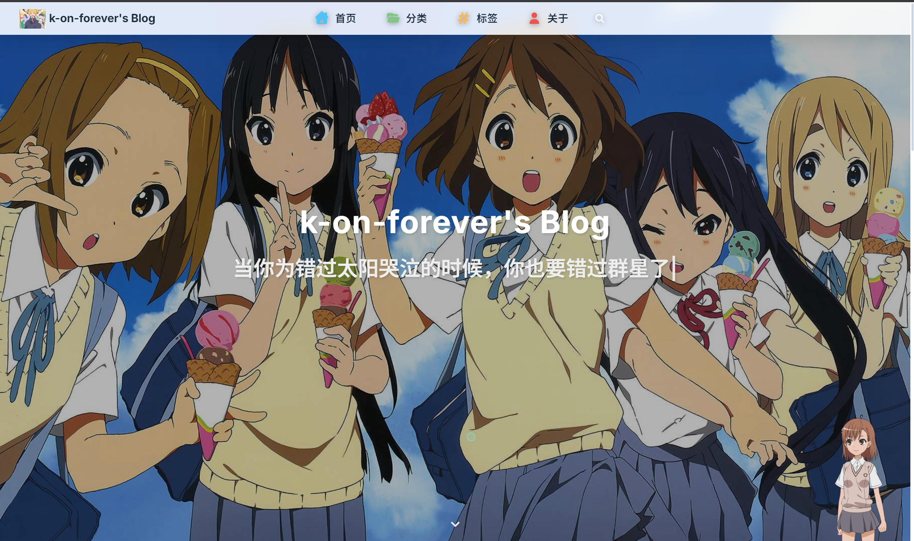
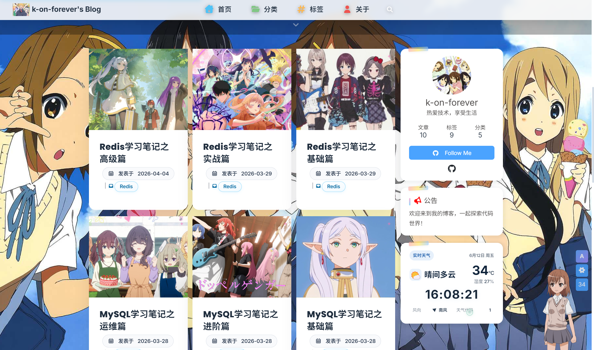
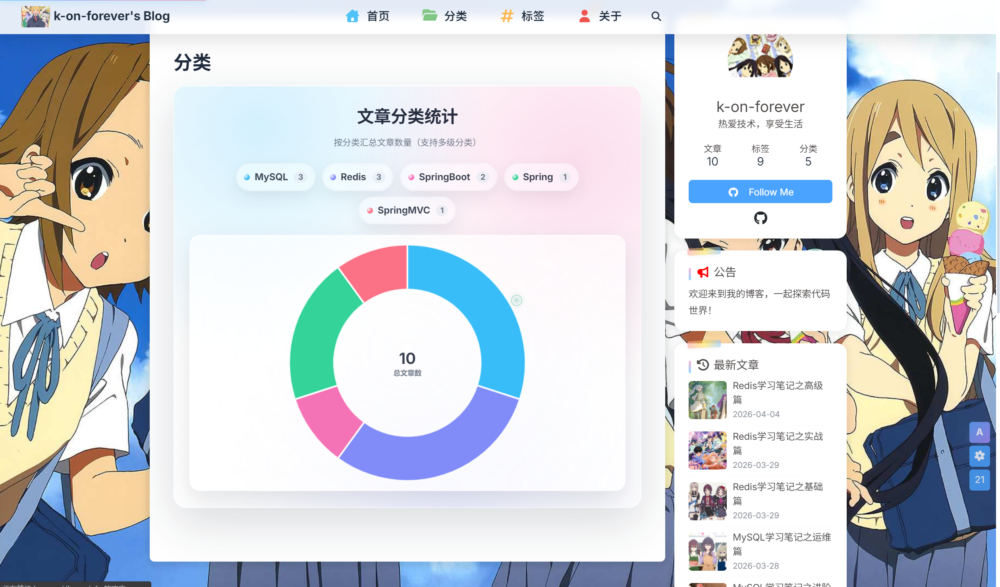
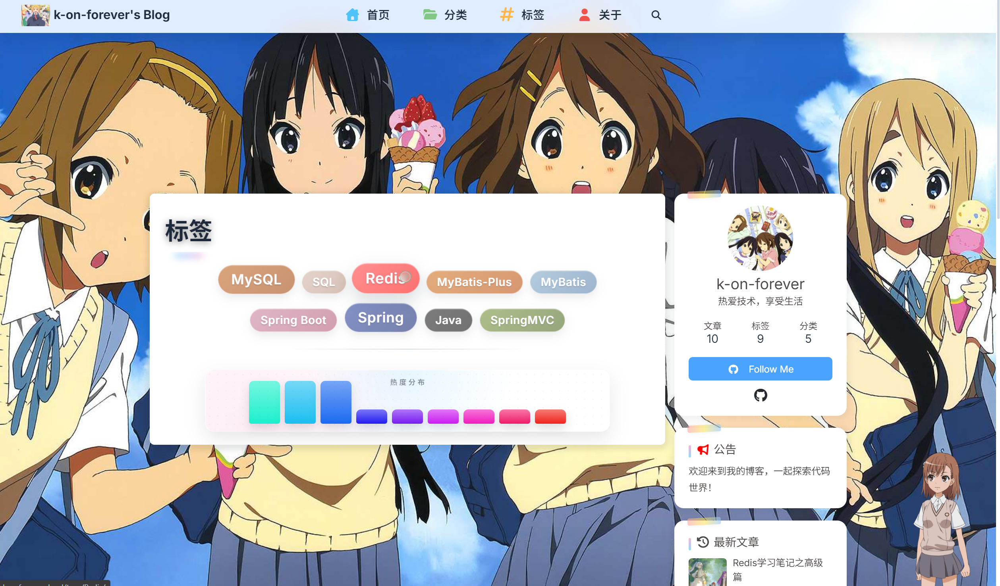
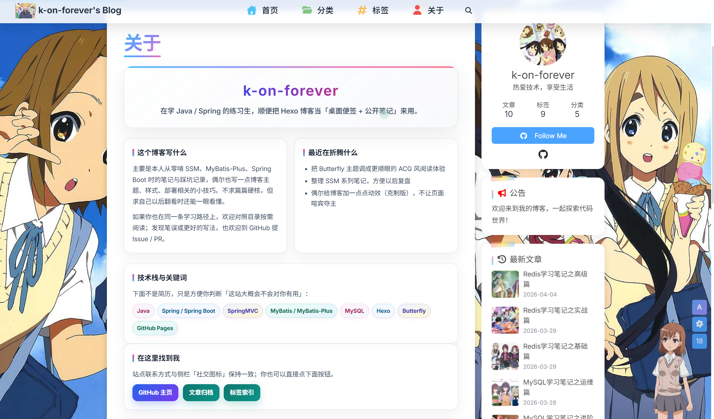

# k-on-forever's Blog

一个基于 [Hexo](https://hexo.io/) + [Butterfly](https://butterfly.js.org/) 主题的技术博客，主要记录 Java / Spring Boot 学习笔记与开发实践。

## 🌟 特性

- 📝 **技术笔记**：Java、Spring Boot、MySQL、Redis 等学习记录
- 🎨 **Butterfly 主题**：现代化响应式设计，支持暗色模式
- 🔍 **全文搜索**：基于 `hexo-generator-searchdb` 的本地搜索
- 📊 **站点地图**：自动生成 sitemap.xml，利于 SEO
- 📡 **RSS 订阅**：支持 Atom 格式的 Feed 输出
- 🚀 **一键部署**：支持 GitHub Pages / Vercel / Netlify 等平台

## 📸 预览

> 💡 将截图放在 `screenshots/` 目录下，然后在此处引用

| 首页 | 文章页 | 分类页 |
|------|--------|--------|
|  |  |  |

| 标签页 | 关于页 |
|--------|--------|
|  |  |

## 🛠️ 技术栈

- **框架**：Hexo 8.1.1
- **主题**：Butterfly
- **部署**：GitHub Pages / 自定义服务器
- **编辑器**：VS Code

## 📦 安装与使用

### 环境要求

- Node.js >= 18
- npm >= 9

### 安装依赖

```bash
npm install
```

### 本地开发

```bash
npm run server
```

访问 `http://localhost:4000` 预览博客。

### 创建新文章

```bash
hexo new "文章标题"
```

### 生成静态文件

```bash
npm run build
```

### 部署

```bash
npm run deploy
```

## 📁 项目结构

```
.
├── _config.yml           # Hexo 主配置文件
├── _config.butterfly.yml # Butterfly 主题配置
├── source/
│   ├── _posts/           # 博客文章
│   ├── img/              # 图片资源
│   ├── about/            # 关于页面
│   ├── categories/       # 分类页
│   └── tags/             # 标签页
├── themes/
│   └── butterfly/        # Butterfly 主题
├── scripts/              # 自定义脚本
└── public/               # 生成的静态文件
```

## 🖼️ 图片管理

图片统一存放在 `source/img/` 目录下，在文章中引用：

```markdown

```

## 🔧 常用命令

| 命令 | 说明 |
|------|------|
| `npm run server` | 启动本地服务器 |
| `npm run build` | 生成静态文件 |
| `npm run deploy` | 部署到服务器 |
| `hexo new "标题"` | 创建新文章 |
| `hexo clean` | 清除缓存和 public 目录 |

## 📝 文章格式

新建文章位于 `source/_posts/` 目录，格式如下：

```markdown
---
title: 文章标题
date: YYYY-MM-DD HH:mm:ss
tags:
  - 标签1
  - 标签2
categories:
  - 分类
---

正文内容...
```

## 🌐 访问地址

- **博客地址**：https://kon-forever.cloud
- **GitHub 仓库**：https://github.com/k-on-forever/blog

## 📄 License

MIT License

---

> 💡 如有问题或建议，欢迎提 Issue 或 PR。